# PRÁCTICA PR0501: Creación de un módulo básico
## Guía para crear módulos para Odoo.
### Paso 1
Lo primero que tenemos que hacer es activar el modo de desarrollador dentro de nuestro panel de ajustes de Odoo.
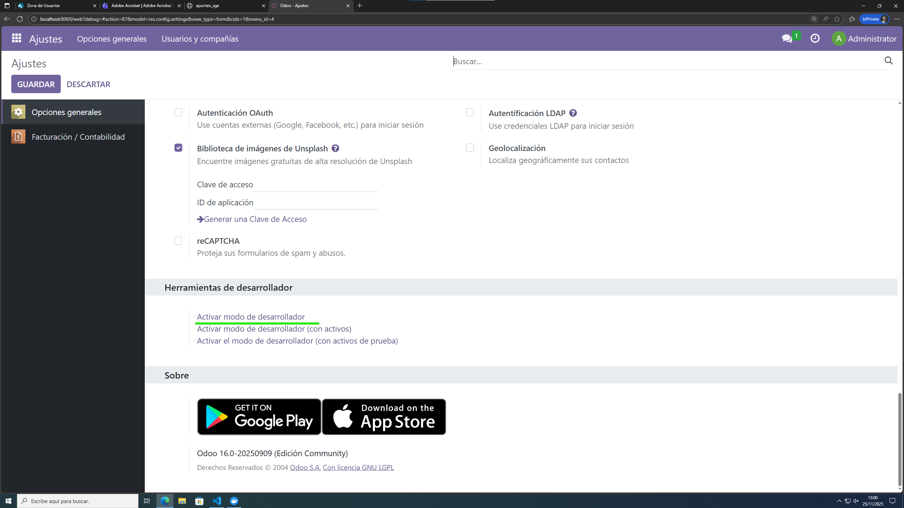

### Paso 2
Vamos a acceder a nuestro contenedor de Odoo con la orden "docker exec"
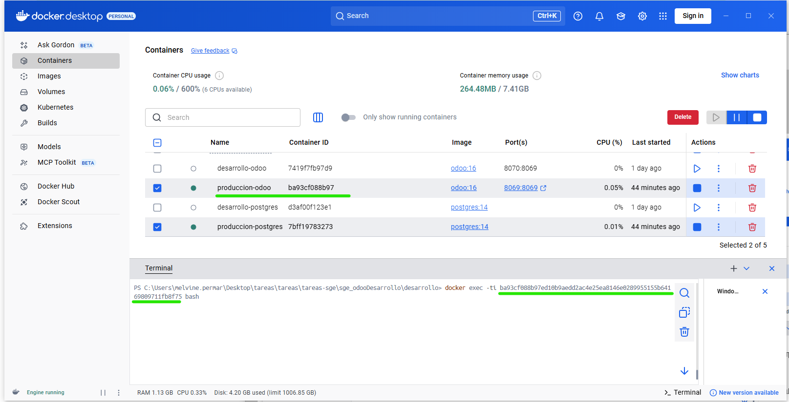

### Paso 3
Ejecutaremos la orden "odoo scaffold", seguido del nombre del modelo, para crear una estructura básica de un modelo de Odoo y tomarlo de referencia.
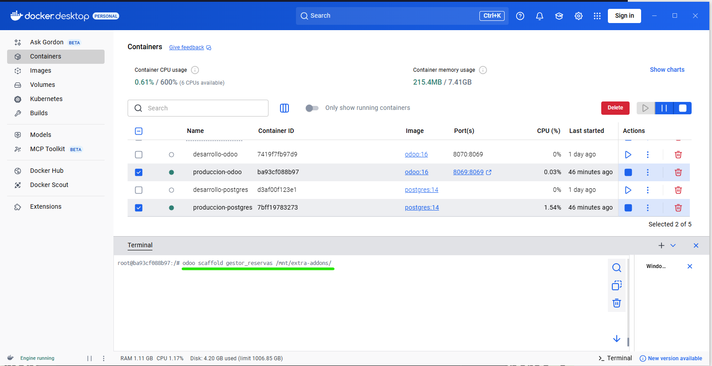

### Paso 4
Como vmeos, se nos ha creado una carpeta con el nombre del modelo.
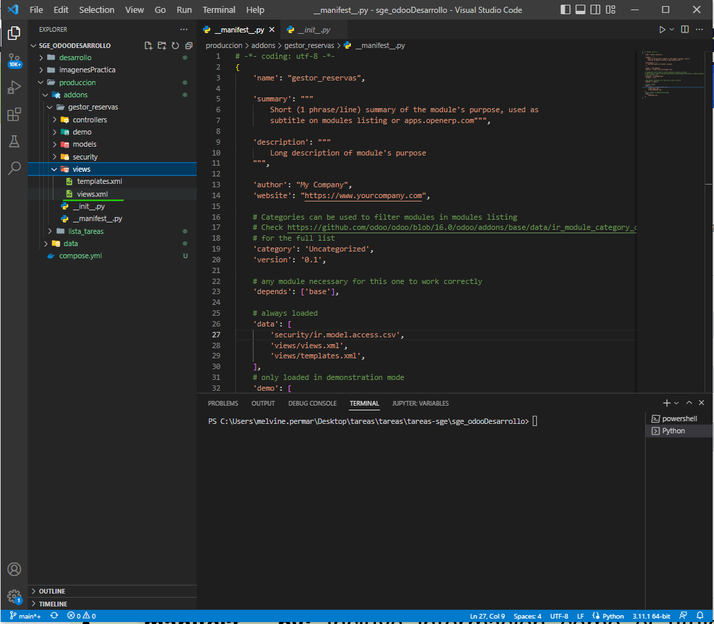

### Paso 5
Descomentaremos la siguiente línea de código.
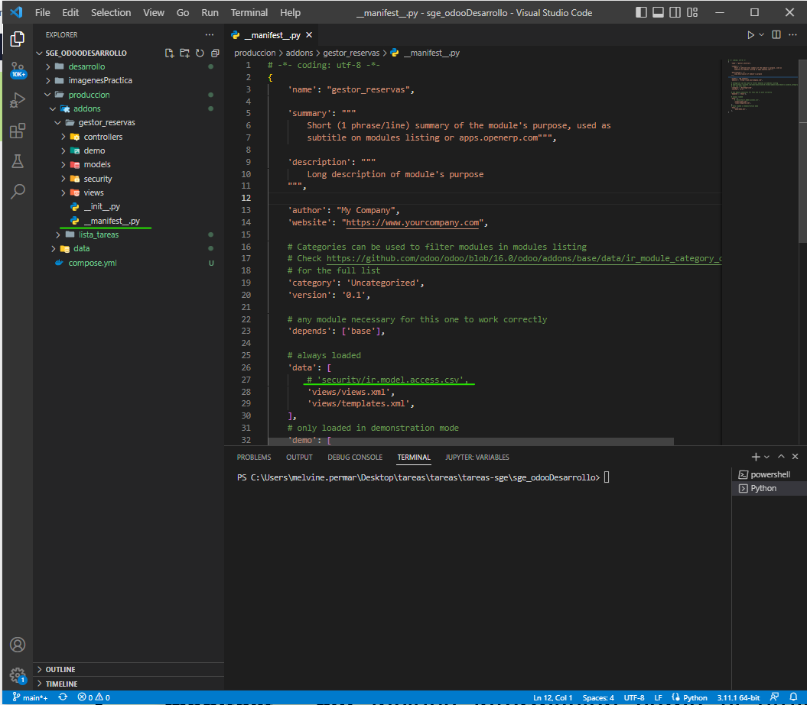

### Paso 6
Ahora crearemos el modelo "gestor_reservas"
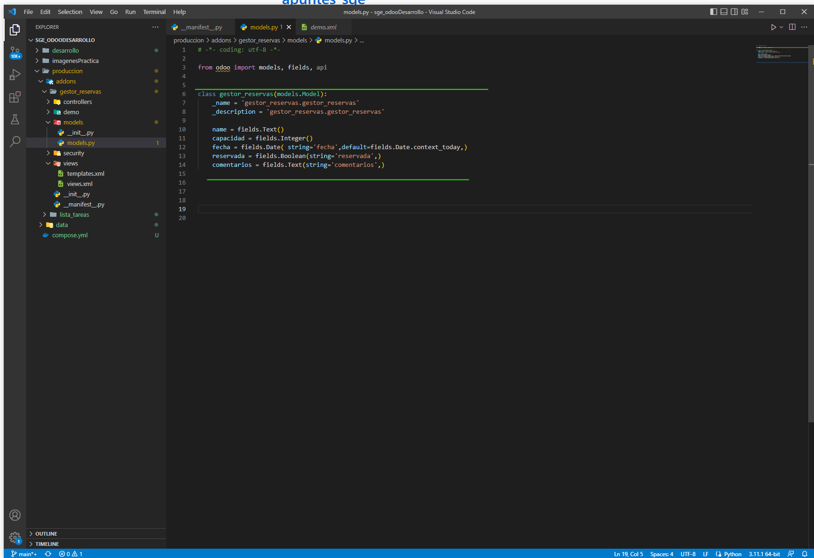

### Paso 7
Para las vistas, Odoo nos crea un código de ejemplo segun el nombre del módulo como vemos en la siguiente imagen
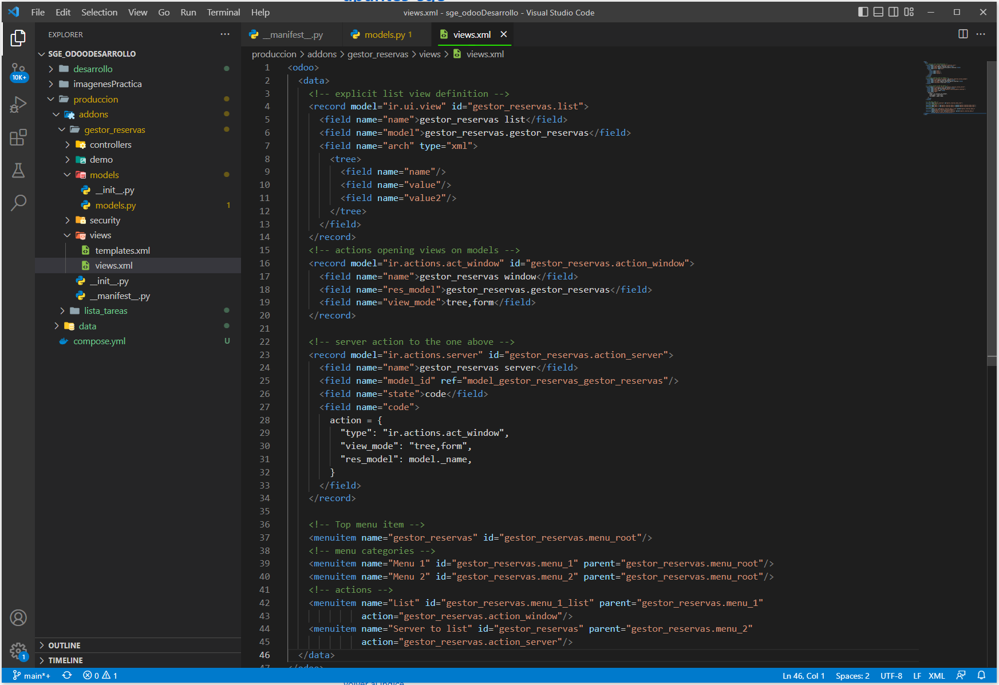

### Paso 8
Nuestro archivo "views.xml" quedaría de la siguiente forma para cumplir los requisitos de la práctica. 
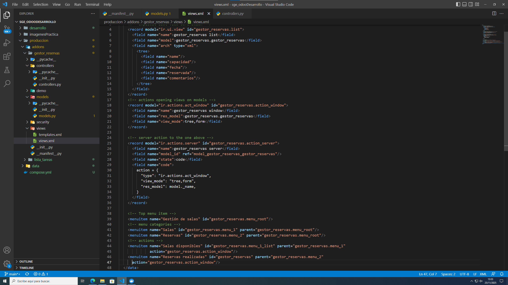

#### Paso 9
Ahora vamos a actualizar nuestra lista de aplicaciones para hacer visible nuestro módulo.

### Paso 10
Hacemos clic en "Actualizar"
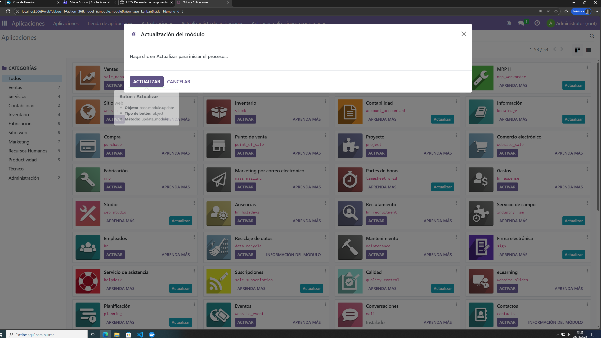

### Paso 11
Ahora buscaremos nuestro módulo en la barra de búsqueda.
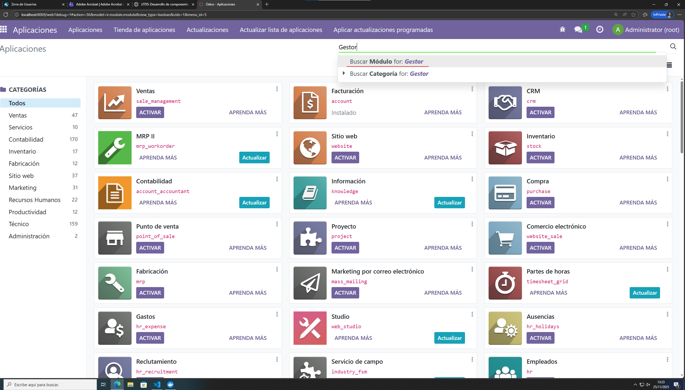

### Paso 12
Como vemos, ya nos aparece nuestro módulo, ahora debemos activarlo.
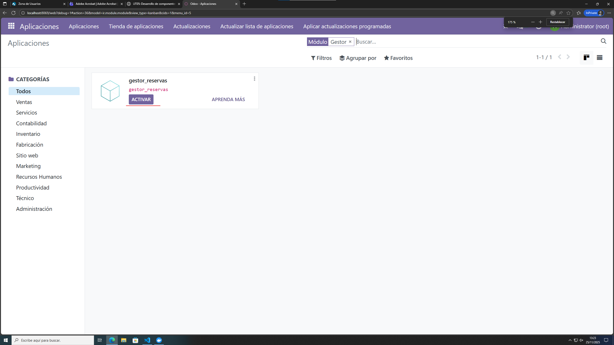

### Paso 13
Como vemos, ya tenemos nuestro módulo con los menú correspondientes.
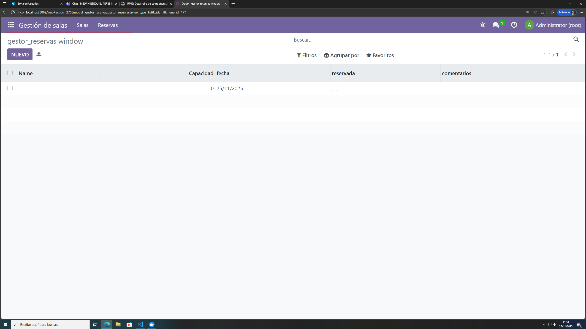
