# GUIA PRACTICA 601

## Paso 1
Nos situamos sobre el contenedor de odoo
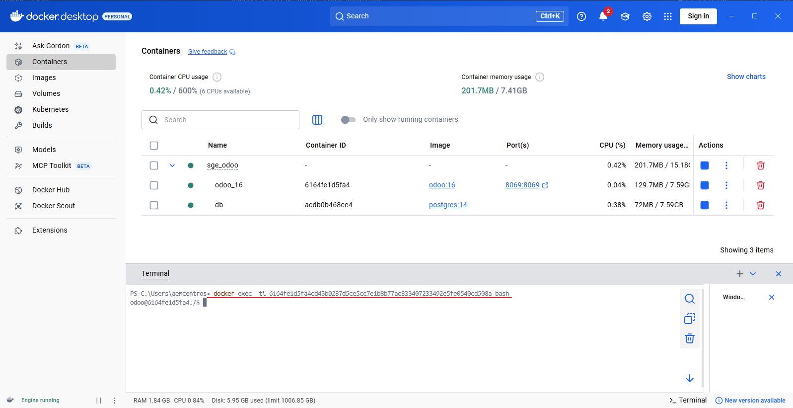

## Paso 2
Ejecutamos la orden odoo scaffold 

## Paso 3
Creamos el modelo "producto"
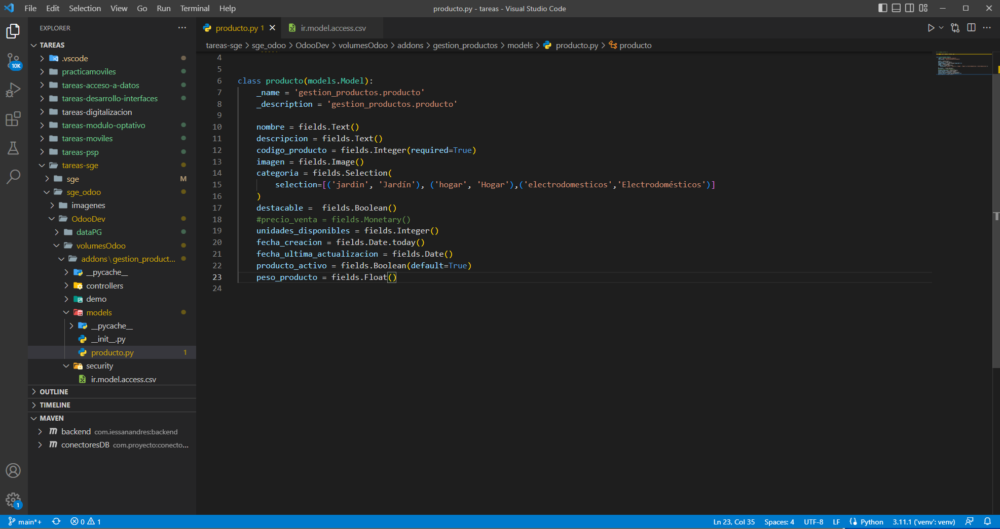

## Paso 4
Importamos el modelo en el archivo "__init__.py"
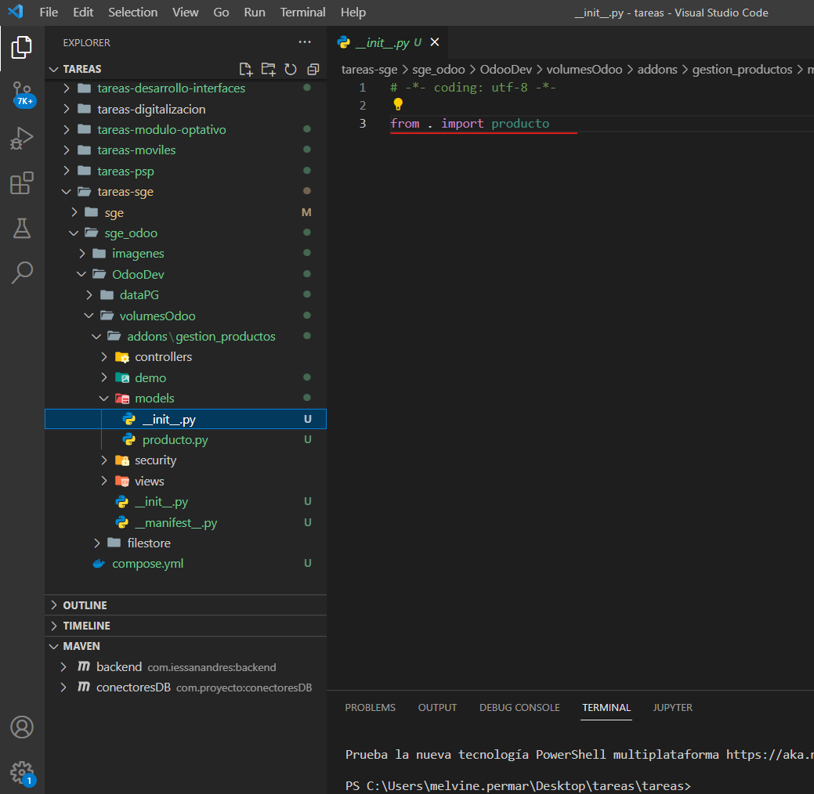

## Paso 5
Definimos las vistas de nuestro modelo
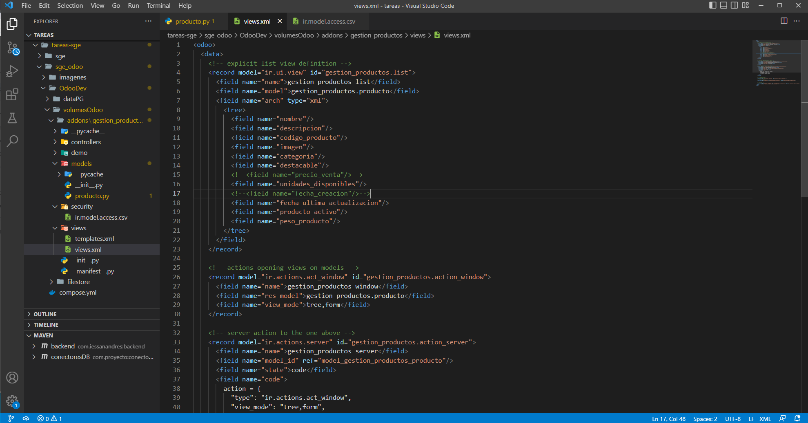
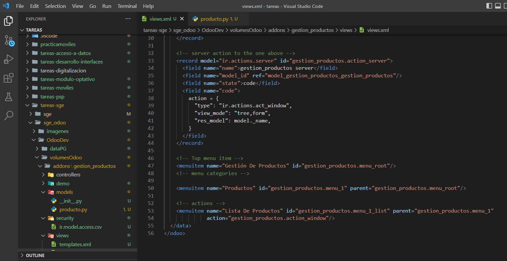

## Paso 6
Definimos las vistas de nuestro modelo

## Paso 7
Configuramos el fichero ir.model.access.csv
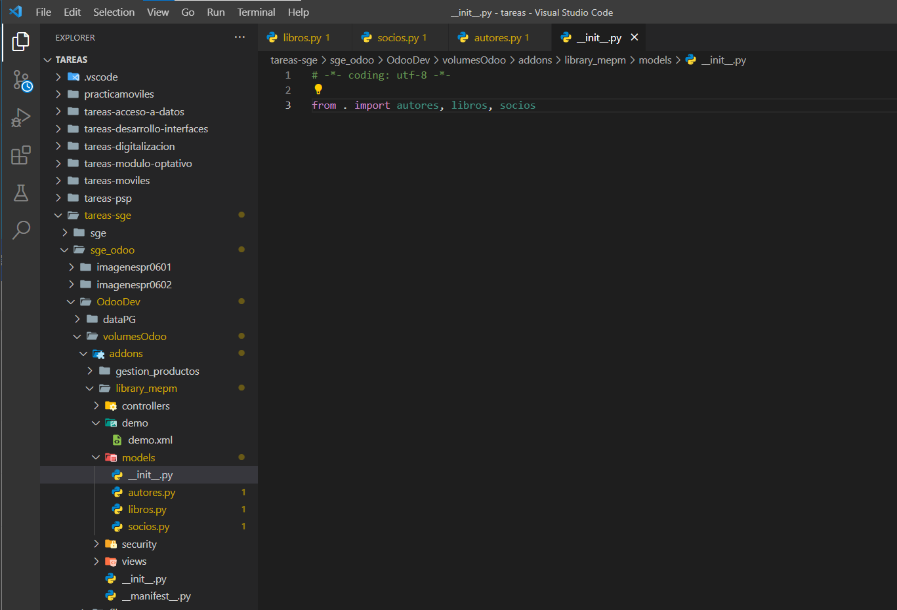

## Paso 8
Dentro de la configuración de odoo, activamos el modo desarrollador
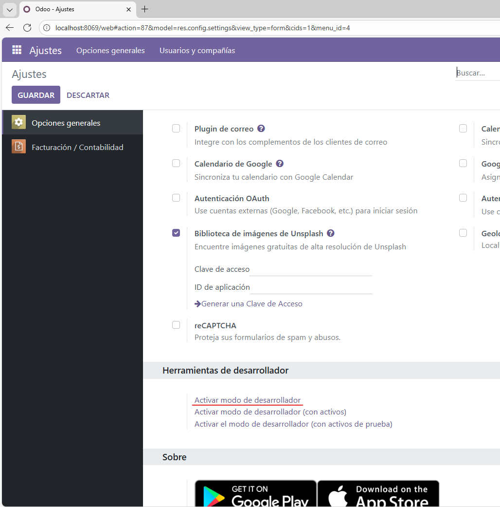

## Paso 9
Actualizamos nuestra lista de aplicaciones
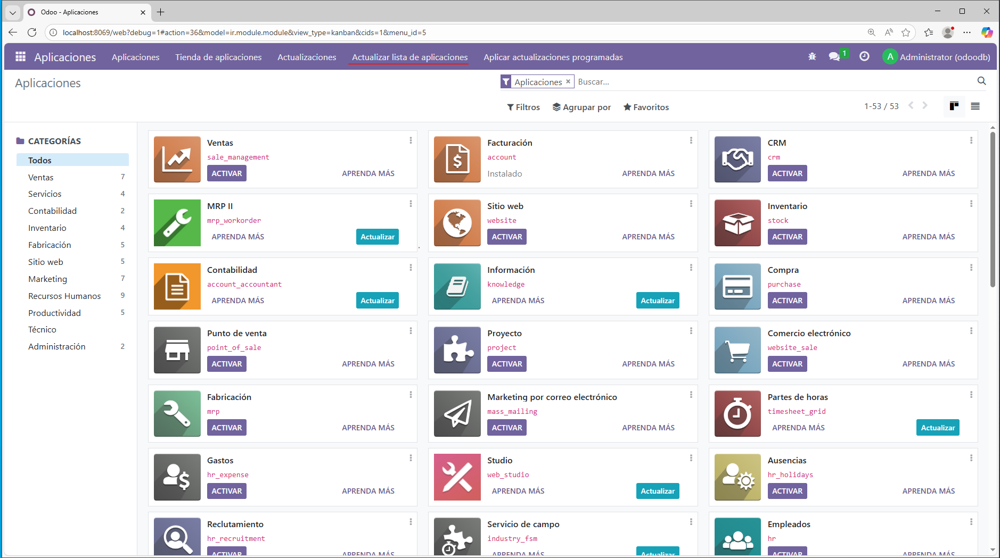

## Paso 10
Buscamos nuestro módulo
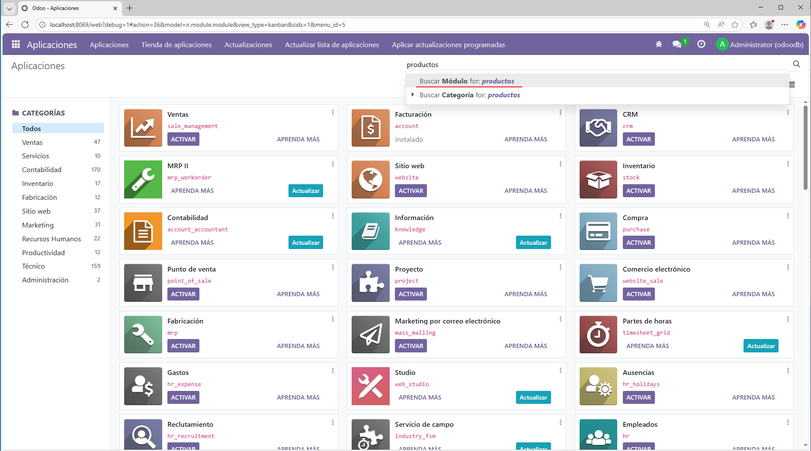

## Paso 11
Activamos el módulo
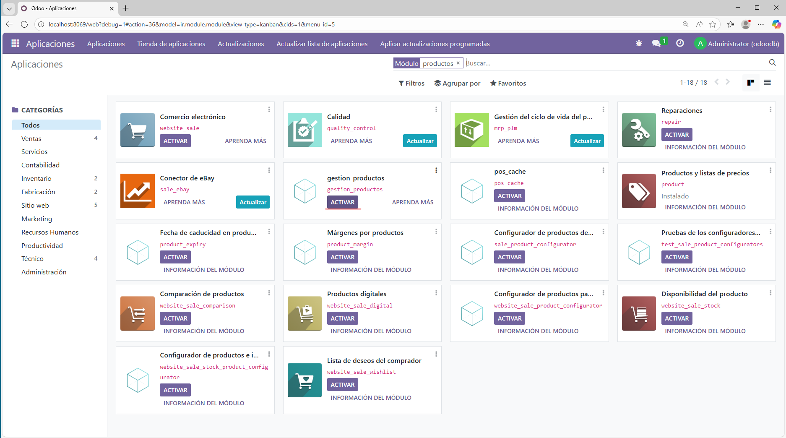

## Paso 12
Ya nos aparece el modulo en nuestro menú
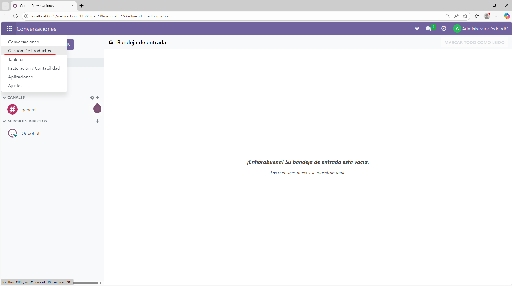

## Paso 13
Ya tenemos nuestro nuevo modulo importado
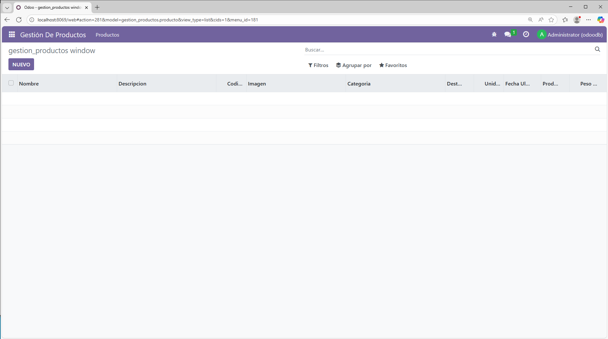
