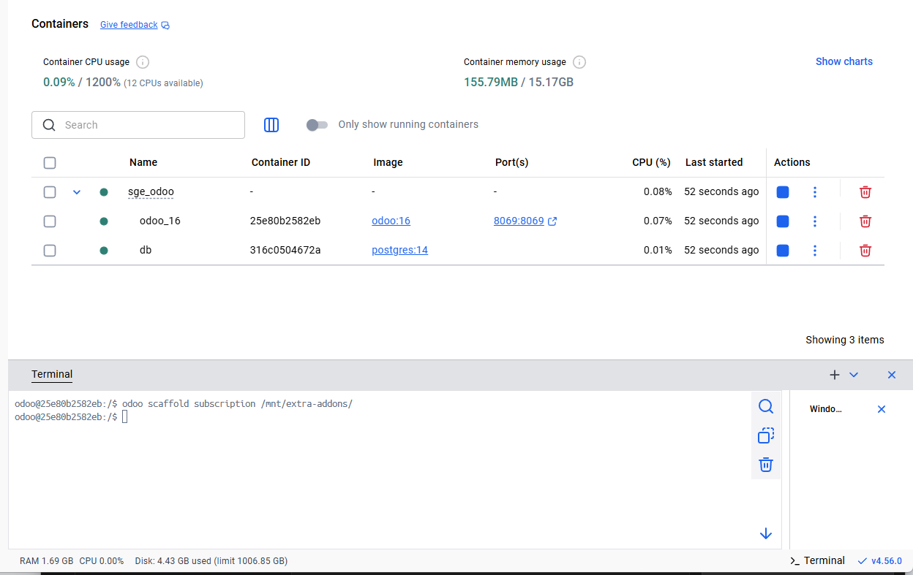
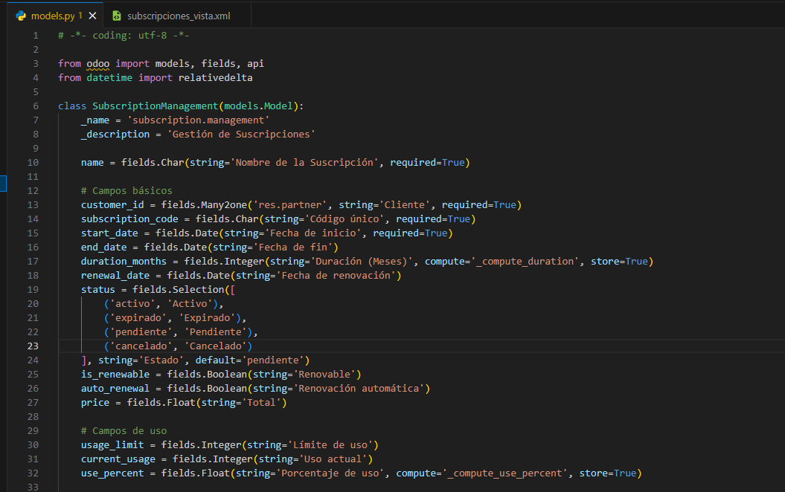
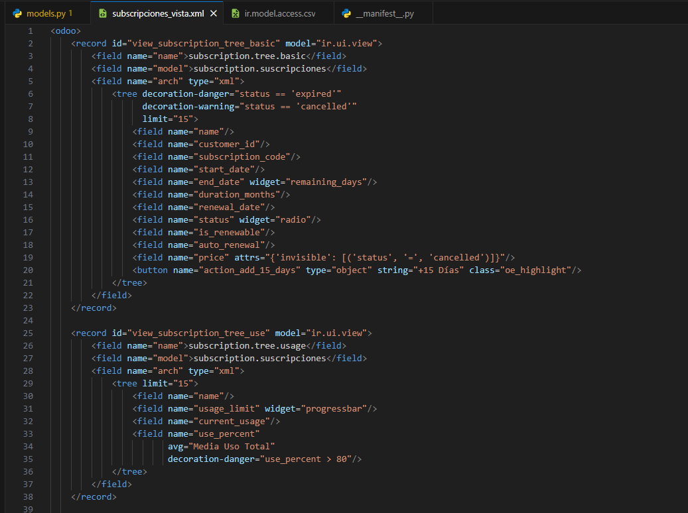
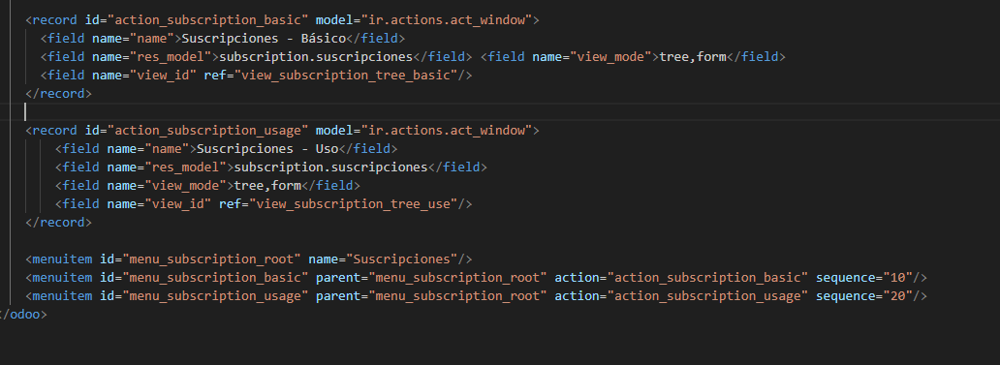
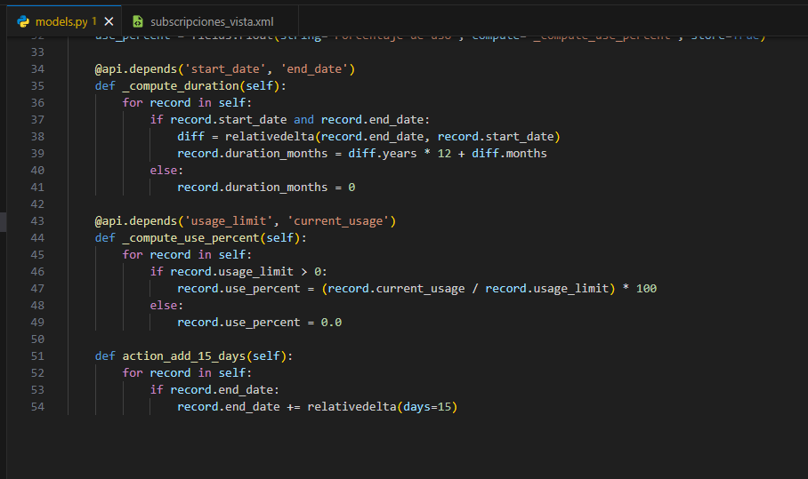
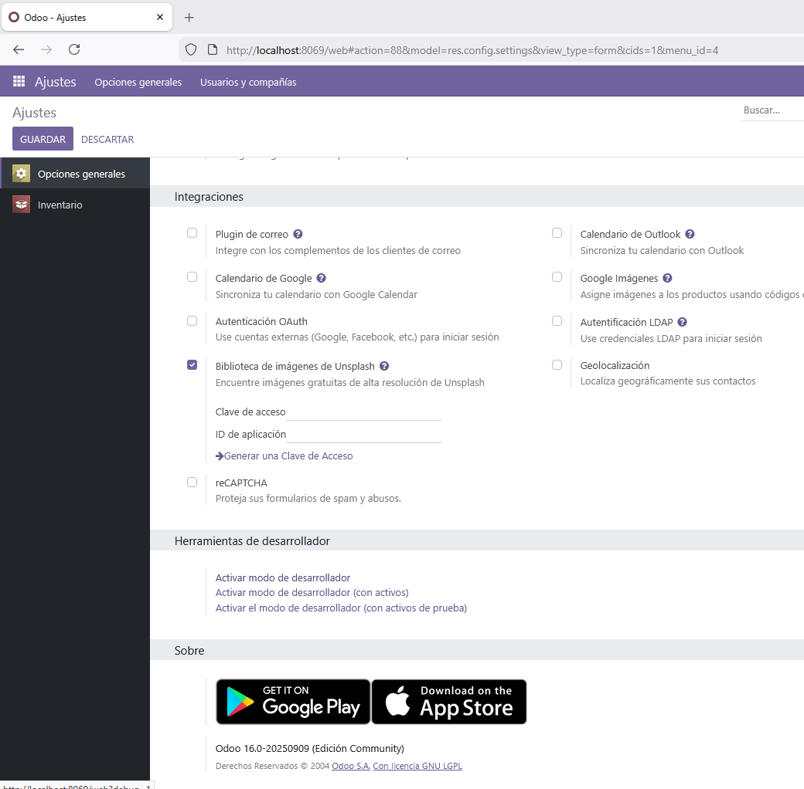
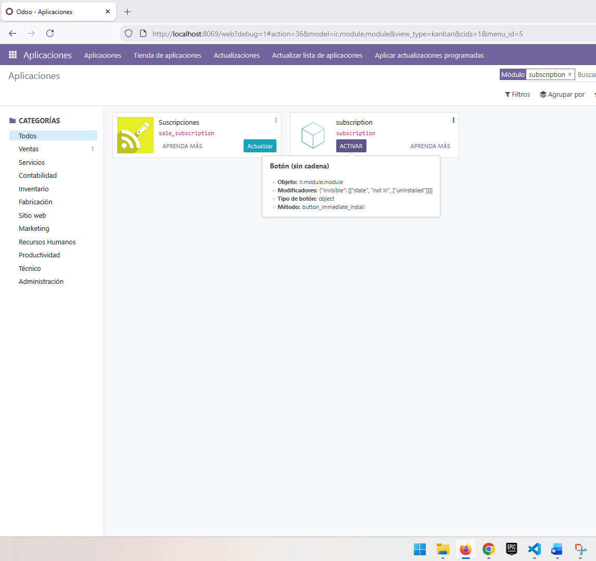
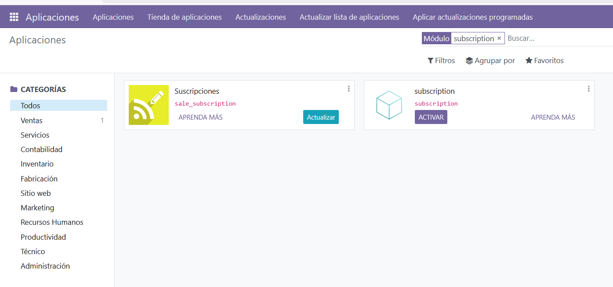
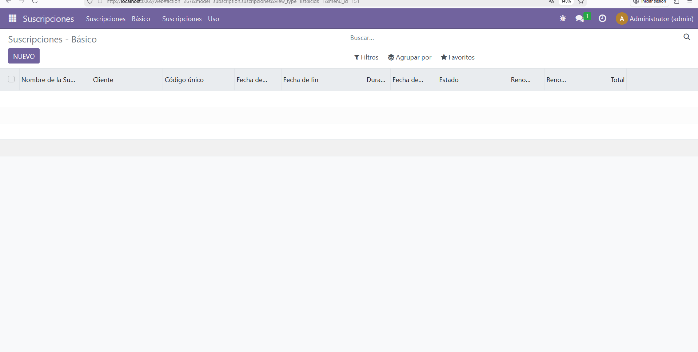

# Guía Práctica PR0604: Vista de tipo lista

## Paso 1. 
Creamos la plantilla para el módulo con la siguiente orden desde la terminal:

## Paso 2. 
Creamos el modelo con los campos correspondientes:

## Paso 3. 
Definimos las vistas y sus características:

## Paso 4. 
Definimos las funciones para nuestro modelo:

## Paso 5. 
Cargamos el .xml en nuestro manifest y nuestro csv:

## Paso 6. 
Activamos el modo desarrollador dentro de nuestra sección de ajustes en Odoo:

## Paso 7.
Buscamos nuestro módulo y lo activamos:

## Paso 8.
Ahora, en el menú ya nos aparece el módulo:

## Paso 9.
Como vemos ya podemos manejar nuestras suscripciones:
