# PR0606: Gestión de un taller mecánico
## Guía Resolución Práctica.
### Paso 1. 
Creamos el módulo\
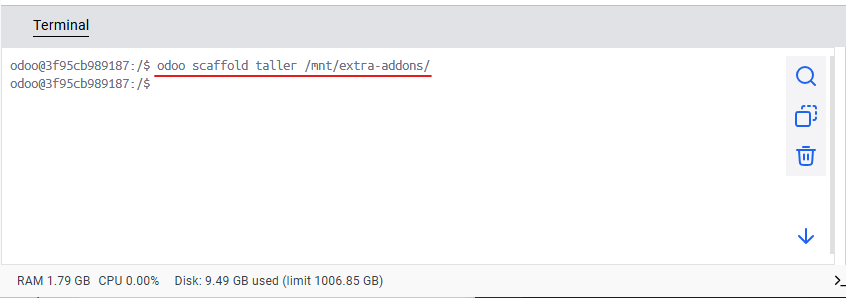

### Paso 2.
Definimos los modelos
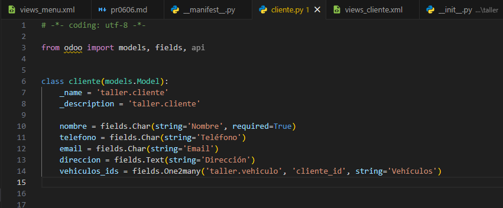
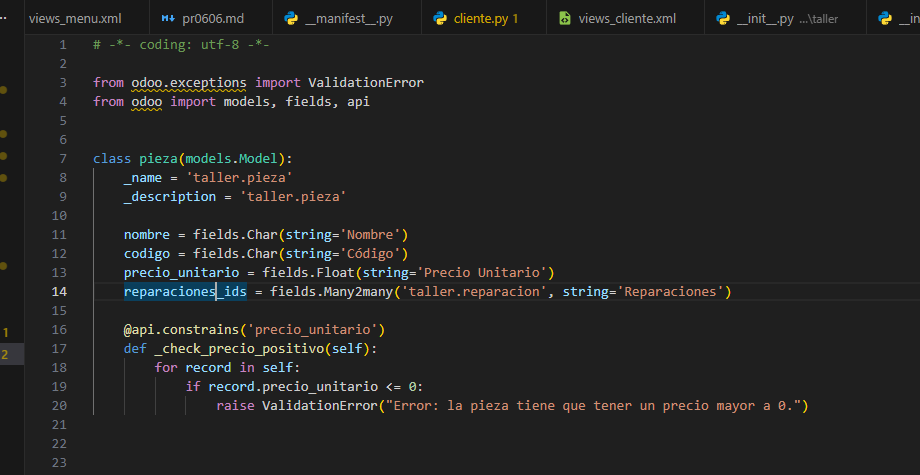
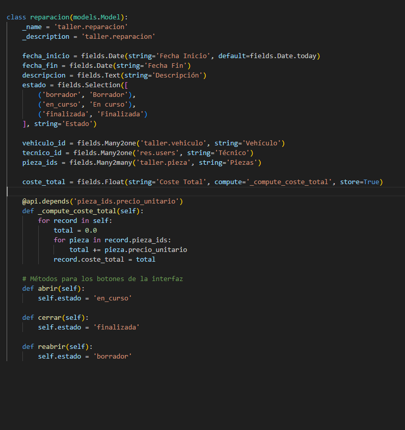
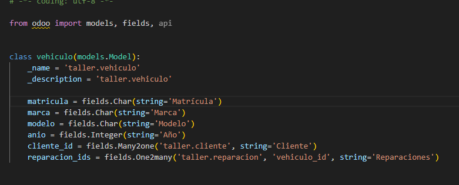

### Paso 3.
Definimos las vistas para nuestros modelos y el menú
- Vista cliente\
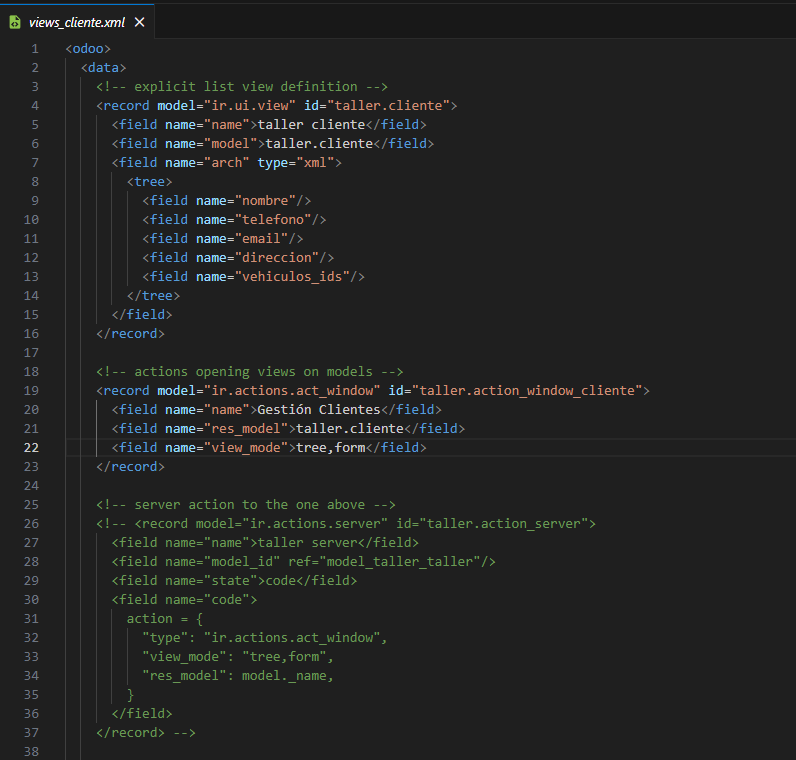

- Vista pieza:\
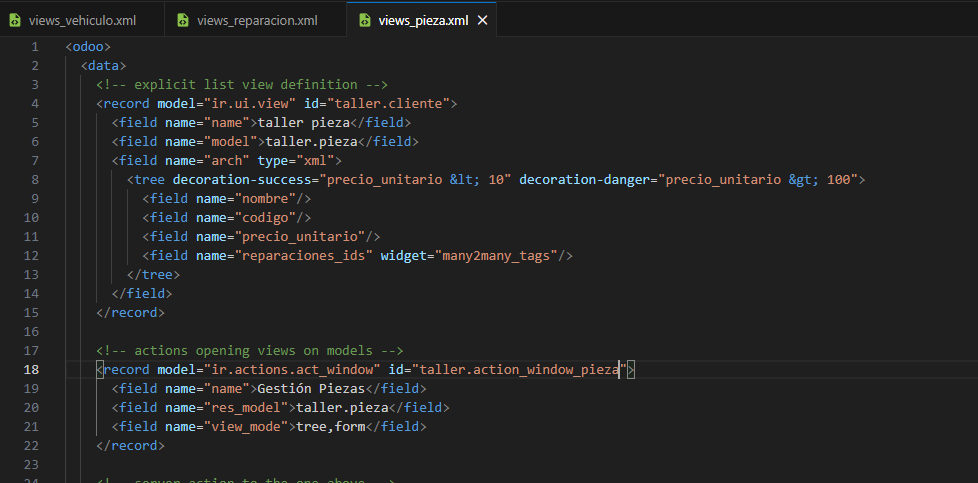

- Vista reparacion:\
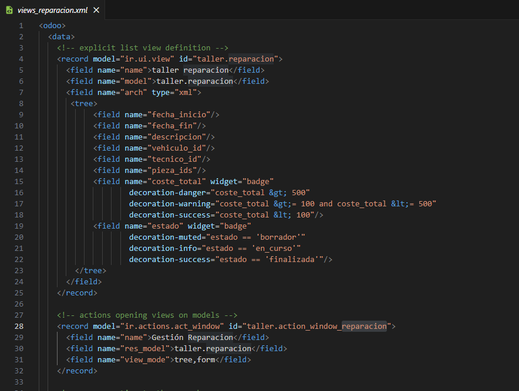

- Vista vehiculo:\
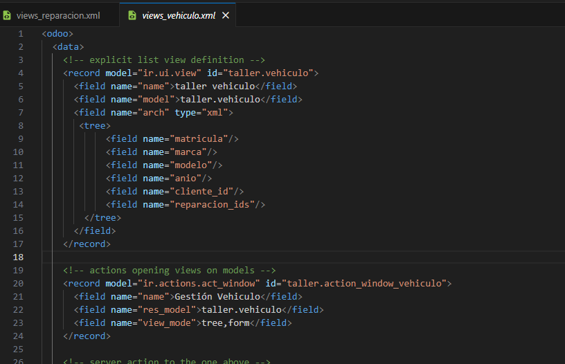

- Vista menú:\
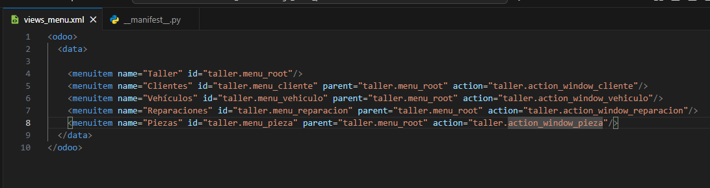

### Paso 4.
Actualizamos el archivo 'ir.model.access.csv'\
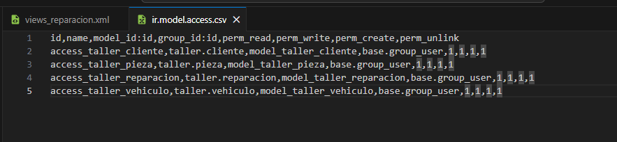

### Paso 5.
Actualizamos el '__manifest__.py'\
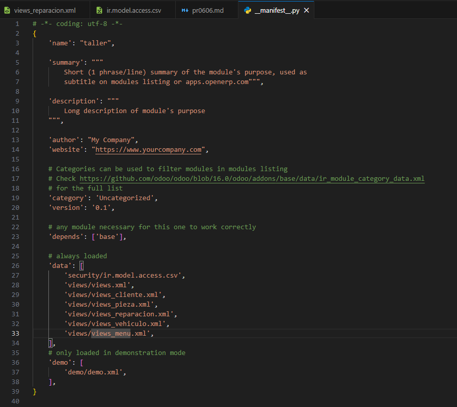

### Paso 6.
Dentro de la configuración de Odoo, activamos el modo desarrollador.\
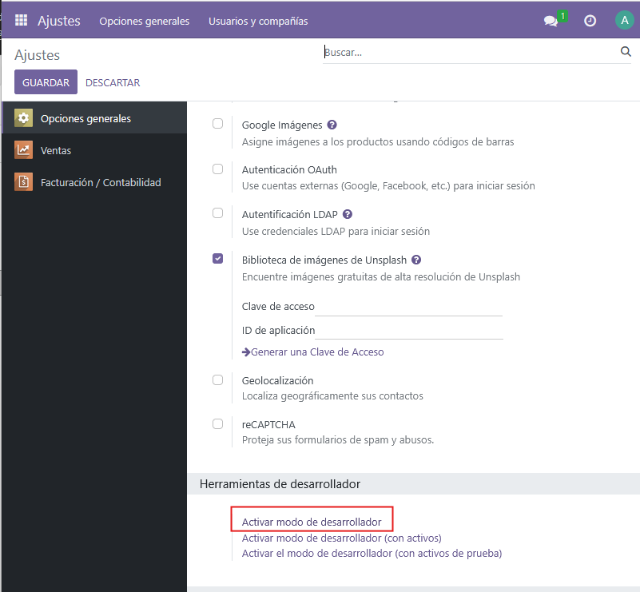

### Paso 7.
Buscamos nuestro módulo y lo activamos\
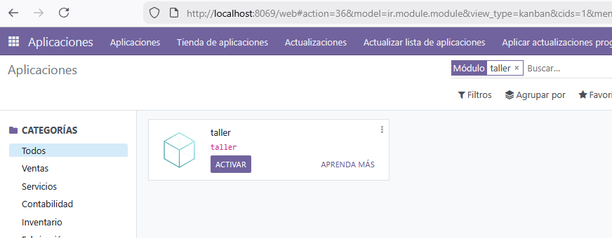

### Paso 8.
Resultado
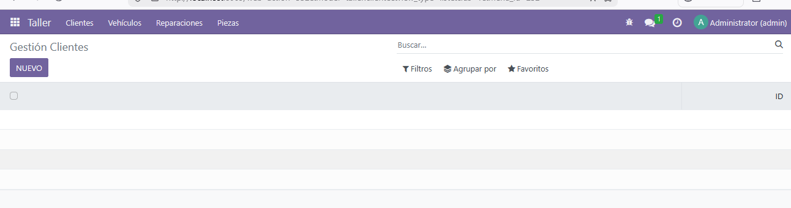

